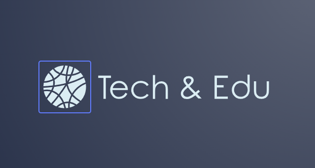

<p align="center" width="100%">
     
</p>

# SCHOOL LIBRARY OOP APP

<a name="readme-top"></a>

<!-- TABLE OF CONTENTS -->

# 📗 Table of Contents

- [📖 About the Project](#about-project)
  - [🛠 Built With](#built-with)
    - [Tech Stack](#tech-stack)
    - [Key Features](#key-features)
- [💻 Getting Started](#getting-started)
  - [Setup](#setup)
  - [Prerequisites](#prerequisites)
  - [Install](#install)
  - [Usage](#usage)
- [👥 Authors](#authors)
- [🔭 Future Features](#future-features)
- [🤝 Contributing](#contributing)
- [⭐️ Show your support](#support)
- [🙏 Acknowledgements](#acknowledgements)
- [📝 License](#license)

<!-- PROJECT DESCRIPTION -->

# 📖 [School Library OOP App] <a name="about-project"></a>

> This is a simple Ruby desktop app project for implementing a School Library using OOP.

**[School Library OOP App]** It's a simple Ruby desktop app project for implementing a School Library using OOP.

## 🛠 Built With <a name="built-with"></a>

### Tech Stack <a name="tech-stack"></a>

- RUBY LANGUAGE.
- VS CODE (code editor).
- RUBOCOP (Ruby linter code analyzer).

<!-- Features -->

### Key Features <a name="key-features"></a>

- **The app implements three main classes: Person, Student, and Teacher.**
- **It uses class and module concepts.**
- **Implements OOP Ruby concepts.**
- **Adds a decorator class and two subclasses: capitalize & trimmer.**

<p align="right">(<a href="#readme-top">back to top</a>)</p>

<!-- GETTING STARTED -->

## 💻 Getting Started <a name="getting-started"></a>

> This project could be used for implementing a School Library using OOP desktop app with the Ruby language.
> It can also be converted into a webpage.

To get a local copy up and running, follow these steps.

Clone this repository to your desired folder by running the following commands in your terminal:

```sh
  cd your-prefered-folder-name
  
  git clone git@github.com:jcmunav63/school_library_oop.git
```

### Prerequisites

In order to run this project you need:

- An IDE (e.g.: Vscode, Sublime Text,...).
- Install Ruby
- A terminal (Ruby).

### Setup

Clone this repository to your desired folder by running the following commands in your terminal:

```sh
  cd your-prefered-folder-name
  
  git clone git@github.com:jcmunav63/school_library_oop.git
```

### Install

Install this project with:

```sh
  cd school_library_oop

  gem install bundler

  bundle init

  Add this line to your Gemfile
    gem 'rubocop', '>= 1.0', '< 2.0'
  
  Run bundle install

  Create a new file .rubocop.yml and copy the file
  provided in the linters instructions.
```

### Usage

To run the project, execute the following command:

```sh
  Install Code-Runner extension on VS Code.

  Install Ruby LSP extension on VS Code.

  Run your program with Run Code option inside of VS Code (Play symbol).
  The output of your code will be shown on the terminal (output tab).
```
### Run your code on IRB (Interactive Ruby Shell)
```
  You can optionally run your code using IRB shell...

  Open your IRB shell.

  Copy your Ruby code to the IRB shell + <Enter>
```

### Run linters tests

To run linters checking, run the following command:

```sh
Run rubocop on your VS Code terminal.

```

<p align="right">(<a href="#readme-top">back to top</a>)</p>

<!-- AUTHORS -->

## 👥 Authors <a name="authors"></a>

👤 **Author1 - Juan Carlos Muñoz**

- GitHub: [@jcmunav63](https://github.com/jcmunav63)
- Twitter: [@jcmunav63](https://twitter.com/jcmunav63)
- LinkedIn: [@juan-carlos-muñoz-navarrete](https://www.linkedin.com/in/juan-carlos-mu%C3%B1oz-navarrete-5a15b6276/)

<p align="right">(<a href="#readme-top">back to top</a>)</p>

<!-- FUTURE FEATURES -->

## 🔭 Future Features <a name="future-features"></a>

- Set up associations between classes and objects.
- Add Book and Rental classes.
- Add a basic console UI for running the app (list people, books and rentals; create people, books and rentals; quit the app).
- We can adapt this code to use on a web app for implementing a School Library using OOP with the Ruby language.

<p align="right">(<a href="#readme-top">back to top</a>)</p>

<!-- CONTRIBUTING -->

## 🤝 Contributing <a name="contributing"></a>

All contributions, issues, and feature requests are welcome!

Feel free to check the [issues page](../../issues/).

<p align="right">(<a href="#readme-top">back to top</a>)</p>

<!-- SUPPORT -->

## ⭐️ Show your support <a name="support"></a>

If you like this project, please support me with a like or a star.

<p align="right">(<a href="#readme-top">back to top</a>)</p>

<!-- ACKNOWLEDGEMENTS -->

## 🙏 Acknowledgments <a name="acknowledgements"></a>

Thank you to my learning partners and the staff at Microverse.

<p align="right">(<a href="#readme-top">back to top</a>)</p>

<!-- LICENSE -->

## 📝 License <a name="license"></a>

This project is [MIT](./LICENSE) licensed.

<p align="right">(<a href="#readme-top">back to top</a>)</p>

